# Built-in Remote Access Architecture

## Purpose and scope

This document is the authoritative design and operations reference for terminal and file access from open-balena-ui to
managed devices.

The built-in implementation replaces the terminal and SSH/SFTP responsibilities of `ob-community/open-balena-remote`. It
deliberately does not replace HTTP-service or VNC proxying yet. Those services continue to require the legacy remote
service when configured.

The built-in implementation provides:

- interactive host and application-container terminals in the browser;
- one public HTTPS/WSS listener shared by every browser and device session;
- authenticated outbound SSH through the existing openBalena tunnel endpoint;
- one reusable, short-lived SSH key per active open-balena-ui user;
- direct, non-staging SFTP uploads and downloads;
- explicit trust, authorization, resource, and lifecycle boundaries.

The compatibility rule is simple:

| `REACT_APP_OPEN_BALENA_REMOTE_URL` | Behavior                                          |
| ---------------------------------- | ------------------------------------------------- |
| Non-empty valid HTTP(S) URL        | Use the legacy iframe-based remote service        |
| Empty or absent                    | Use the built-in terminal and SFTP implementation |

This makes rollback possible without shipping a second UI build.

## Design principles

1. **One public port, not one process or listener per session.** Browser traffic uses the existing ob-ui HTTPS origin.
   No terminal allocates a public or loopback TCP listening port.
2. **The authenticated human remains the SSH identity.** Different users never share an authenticated SSH transport.
3. **Credentials are not browser URL state.** JWTs, private keys, proxy credentials, and reusable WebSocket credentials
   never appear in query strings.
4. **File bytes are streamed.** ob-ui applies bounded backpressure but never stores complete files or transfer fragments
   on its filesystem.
5. **Authorization is checked at the action boundary.** Establishing a browser session does not grant unrestricted
   future access.
6. **Trust failures are visible.** Invalid tokens, denied devices, tunnel failures, changed host keys, missing SFTP
   support, invalid paths, and exhausted quotas produce explicit errors.
7. **Compatibility exceptions are opt-in.** Host-key verification is strict unless an operator deliberately enables the
   legacy-device escape hatch.

## System context

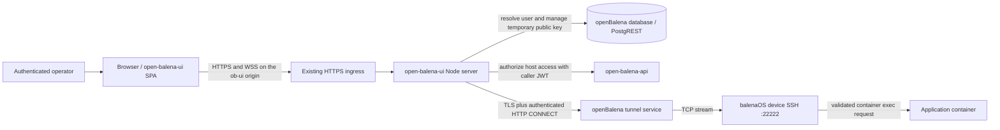

### Public and private network paths

Only the existing ob-ui origin is browser-facing. The ob-ui pod connects to the tunnel service through its internal
Kubernetes service name when available. It does not need to join the device VPN and does not connect directly to device
VPN addresses.

The operator's workstation-equivalent flow:

```text
proxytunnel -> tunnel endpoint -> CONNECT <uuid>.balena:22222 -> SSH
```

becomes an in-process protocol flow:

```text
Node TLS socket -> CONNECT <uuid>.balena:22222 -> ssh2
```

No `proxytunnel`, balena CLI, OpenSSH client, ttyd, websockify, or per-session child process is required for host
terminals or SFTP.

## Components and responsibilities

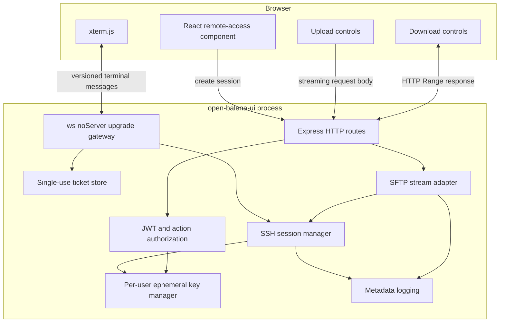

### Express HTTP routes

The built-in service uses the existing Node listener. Express continues serving all existing API and static-client
routes. Remote-access HTTP routes are mounted before the SPA catch-all route.

Responsibilities:

- bearer-token verification;
- device authorization;
- issuing single-use WebSocket tickets;
- upload request validation and streaming;
- download metadata, range validation, and streaming;
- consistent error responses without credential disclosure.

### WebSocket gateway

The Node HTTP server owns one `upgrade` handler. Only the documented remote WebSocket path is accepted. The gateway:

- validates the exact request path and configured browser Origin;
- atomically consumes a short-lived ticket;
- applies connection, message, and queue limits;
- parses the versioned protocol;
- maps logical terminal channels to SSH channels;
- performs heartbeat and dead-peer cleanup.

### Ephemeral key manager

The key manager owns private-key material and public-key database records.

The private key is exported in **OpenSSH private-key format**, using the existing `micro-key-producer/ssh.js` helper
with a cryptographically random 32-byte seed. Generic Ed25519 PKCS#8 PEM is not supported by the deployed `ssh2` parser
and must not be substituted. Regression tests parse the exported key with `ssh2`, verify its public half matches the
registered key, and exercise signing and signature verification.

Its cache key is the authenticated openBalena user ID. One key may support many simultaneous and sequential operations
by that same user. It is never shared with another user.

Each entry contains:

- user ID and canonical username;
- private key held only in process memory;
- public key and fingerprint;
- unique database row ID/title;
- active operation reference count;
- last release time;
- pending cleanup timer.

### SSH session manager

The session manager opens HTTP CONNECT sockets over TLS for HTTPS endpoints, or plain TCP for explicitly configured
trusted-private-network HTTP endpoints, and passes them to `ssh2`. Its responsibilities are:

- tunnel handshake and response validation;
- SSH authentication as the canonical username;
- SSH host-key verification;
- opening PTY, shell, container, and SFTP channels;
- per-user, per-device, and global quotas;
- cancellation, idle timeout, error propagation, and shutdown.

An SSH transport may multiplex channels belonging to one authenticated user/device session. It must never carry channels
for different users.

## End-to-end authentication and authorization

There are three separate authentication events. They are intentionally not conflated.

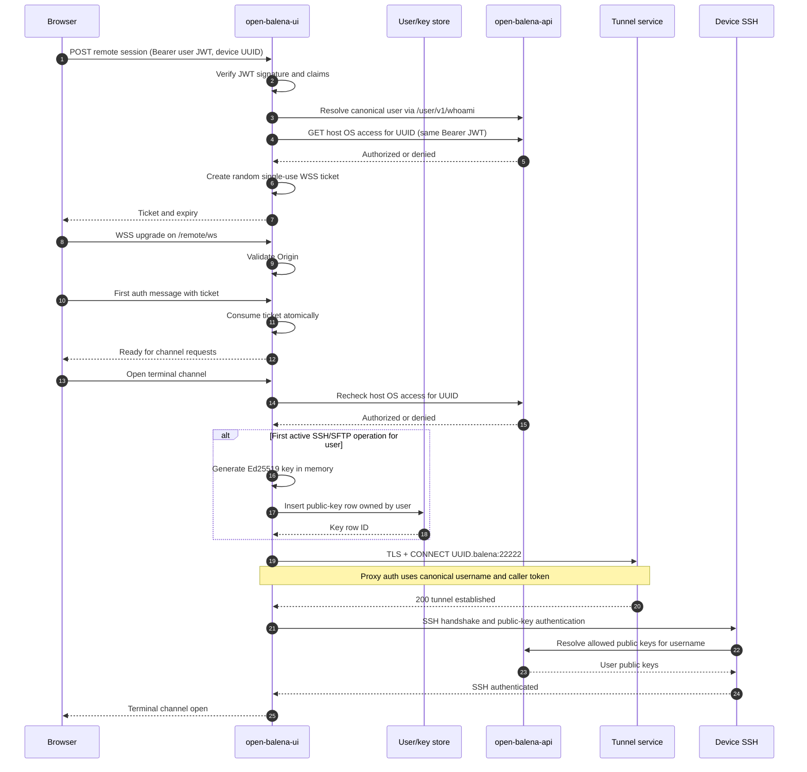

### Browser-to-ob-ui authentication

Normal HTTPS requests use the existing bearer JWT in the `Authorization` header. The existing server middleware verifies
the signature with `OPEN_BALENA_JWT_SECRET` and restricts the accepted algorithm.

Native browser WebSockets cannot set an arbitrary `Authorization` header. The browser therefore first makes an
authenticated HTTPS request. ob-ui returns a cryptographically random, single-use, short-lived ticket. The ticket is:

- stored only in memory unless multi-replica deployment requires a shared store;
- bound to user ID, device UUID, and expected Origin;
- expired after a short interval;
- consumed atomically in the first authentication message after an Origin-validated upgrade;
- useless after first use.

The user JWT is never placed in the WebSocket URL.

Origin checks compare the complete effective origin: HTTP/HTTPS scheme, hostname, and effective port. Direct requests
derive their origin from the socket's TLS state and Host header; forwarded scheme/host headers are not trusted.
For TLS-terminating proxies, configure `OPEN_BALENA_REMOTE_PUBLIC_ORIGIN` to the browser-facing origin, for example
`https://admin.example.test`. Explicit additional origins use `OPEN_BALENA_REMOTE_ALLOWED_ORIGINS`.
An HTTP page cannot use an HTTPS origin's gateway merely because its hostname matches.

Pending tickets have independent per-user and per-process limits, defaulting to 8 and 1024 respectively. These bound
ticket memory even though successful authenticated requests do not consume the general failure-rate quota. Issuance
over either cap returns HTTP `429` with `Retry-After`. A cleanup timer removes expired tickets without further traffic;
consumption (including a failed origin match) releases the ticket slot, and shutdown clears all tickets and timers.

### Device authorization

Before allocating a key or tunnel, ob-ui calls the openBalena host-OS access endpoint using the same user bearer token.
A successful UI login alone is not sufficient. Each terminal, upload, and download is authorized for its requested
device.

### Tunnel proxy authentication

The tunnel connection uses the current user's canonical username and token as required by the openBalena tunnel
protocol. The tunnel enforces access to the requested device UUID.

Tunnel authorization is defense in depth and does not replace the explicit host-access call.

### SSH authentication

SSH authenticates as the canonical openBalena username using the in-memory private key. The device retrieves that
username's public keys through openBalena. Consequently, compatible device/tunnel authentication logs identify the human
user rather than a shared `obui` account.

Container processes generally run as the container's configured Unix user or root. The human identity is preserved at
the SSH boundary; it is not automatically propagated into the container's `/etc/passwd` identity or shell command
history.

## Ephemeral key lifecycle

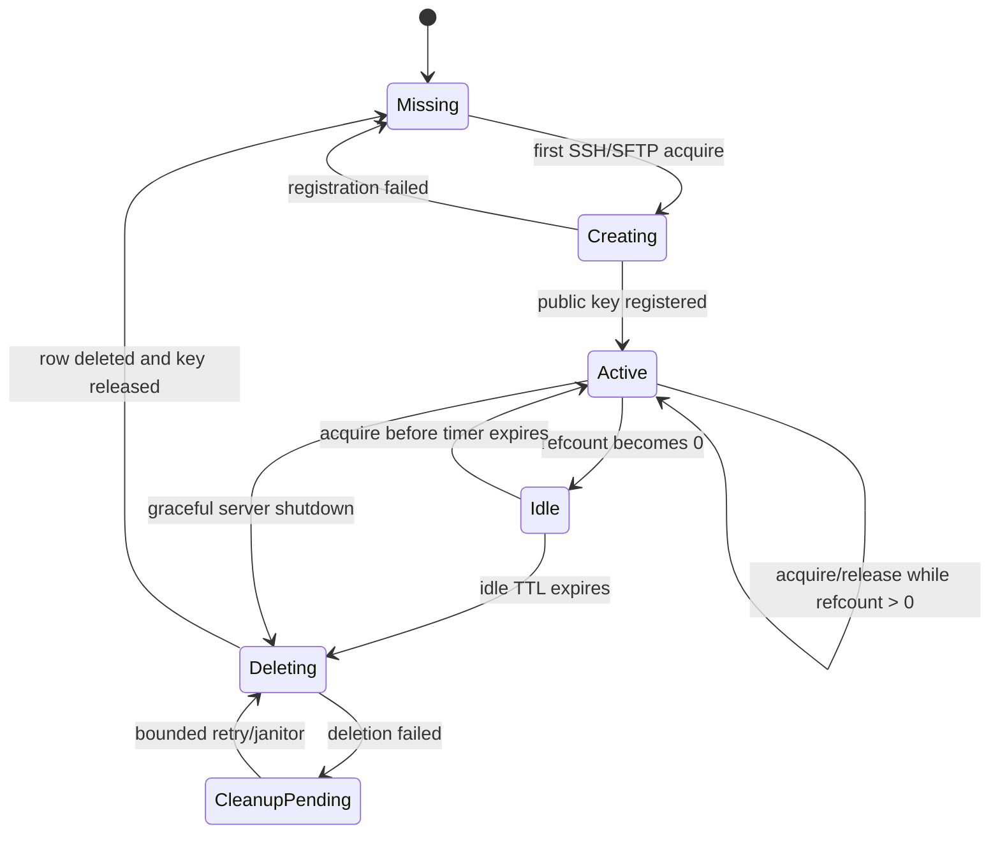

The default idle delay is ten minutes. Operators can change it with `OPEN_BALENA_SSH_KEY_IDLE_TTL_MS`. The timer starts
only when the final terminal or transfer using the key releases its reference. A new operation cancels the timer and
reuses the key.

Acquisition, deletion, and deletion retries are serialized per user. If cleanup has already begun, a new acquisition
waits for it and obtains a registered replacement instead of leasing the key being deleted. Failed deletion entries
are quarantined from reuse; a subsequent acquisition must complete their removal before creating a replacement.
Shutdown prevents new leases while registered-key cleanup runs.

Caller cancellation also covers queued or in-flight key acquisition. It promptly releases that SSH operation's quota
without aborting shared registration/cleanup work needed by another caller. A lease produced after its caller cancels
is released, and cancelled queued callers do not acquire unused leases. Each key-store lookup, registration, or deletion
has a headers-through-response-body deadline using `OPEN_BALENA_REMOTE_CONNECT_TIMEOUT_MS`; this also bounds orphan
cleanup, deletion retries, and shutdown HTTP work.

The deadline is per HTTP request, not one overall acquisition/queue/shutdown deadline. Cancellation does not stop that
shared work even when its sole caller leaves; any late lease follows normal idle cleanup. If a POST commits a public
key but times out before returning its row ID, immediate deletion cannot be guaranteed: later age-qualified orphan
cleanup handles that record.

Every key row has a unique ob-ui-specific title containing a non-secret session identifier. This avoids overwriting
user-managed keys and supports cleanup. Normal cleanup deletes the exact row ID created by the manager. Before creating
a key, opportunistic orphan cleanup may delete only rows bearing the reserved prefix and old enough to exceed the
documented safety interval; it is not a guarantee of immediate cleanup after an abrupt process exit.

JavaScript cannot guarantee physical memory zeroization. The implementation minimizes private-key lifetime, never
serializes it outside the SSH library boundary, and releases all references after cleanup.

## Tunnel and SSH establishment

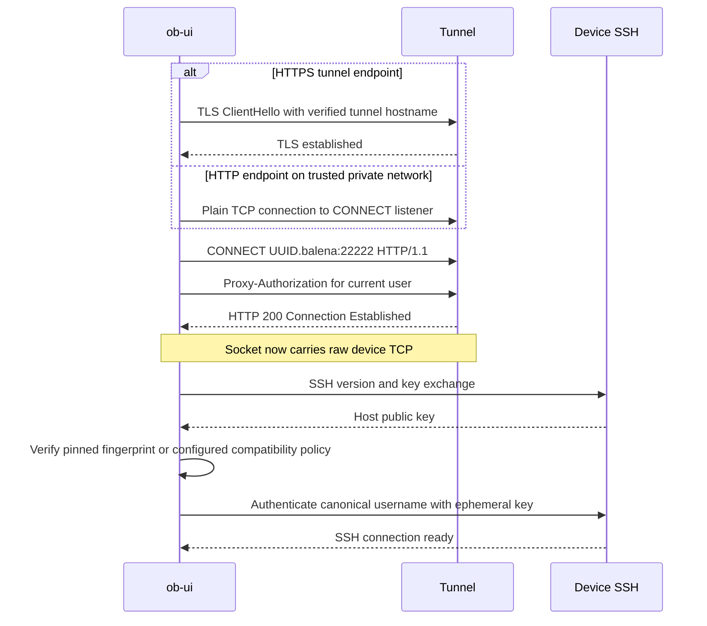

The CONNECT parser accepts only a bounded HTTP response header and requires a successful status. Proxy credentials and
the caller JWT are redacted from every error.
Premature socket EOF/closure before the complete CONNECT response rejects establishment and releases its key lease and
operation quota. Handshake listeners are removed after success or failure; successful sockets remain available to SSH.

For the Mapped dev cluster, the checked infrastructure manifests expose
`http://ob-vpn.openbalena.svc.cluster.local:3128` as the direct CONNECT listener without PROXY headers. Port `443` is
the VPN listener requiring PROXY protocol; port `80` is the VPN HTTP API. Plain HTTP CONNECT sends the proxy
username/token without application-layer TLS, so it is suitable only on a trusted private network or encrypted private
tunnel. The subsequent SSH connection still encrypts terminal/file payloads. The checked Cloudflare ingress
configuration routes `vpn.mgmt.edge-dev.mapped.com` to port `80`; it does not define the
`tunnel.mgmt.edge-dev.mapped.com` Spectrum mapping.

## SSH host-key trust

Strict verification is the default. Operators should configure pinned SHA-256 SSH host-key fingerprints, preferably per
device. A wildcard pin may be used only when the deployment intentionally uses one host key across a managed fleet.

The compatibility option `OPEN_BALENA_SSH_ALLOW_UNVERIFIED_HOST_KEYS=true` permits connection when no matching pin is
available. It exists only for old devices and migrations. It restores the trust weakness of the legacy implementation
and should be temporary, narrowly deployed, and monitored.

A changed configured fingerprint always fails. The compatibility option must not silently override an explicit
mismatching pin.

Long term, a deployment-managed SSH host CA is preferable to individual pins if balenaOS provisioning can supply host
certificates.

## Browser workspace and session ownership

The built-in workspace has a tab strip, a terminal area, and a separate Upload/Download panel. Add a terminal with the
`+` button, choose Host OS or a running application service in the centered overlay, and select **Start terminal**. The
overlay disappears after the SSH channel opens. The start action becomes **Cancel connection** during connection
establishment. Close a connected shell with its tab's `X`; there is no duplicate Disconnect button. Connection state is
shown by a dot in the tab, rather than a detached status label next to competing actions.

Each tab owns its xterm instance, terminal buffer, connection state, cancellation controller, and authenticated
WebSocket. **The current UI opens one WSS connection per tab, using logical channel 1 on each connection.** The server
protocol supports multiple channels on one connection, but the UI deliberately isolates tabs for independent failure and
teardown. Every connection still uses the same public HTTPS port; there are no per-tab listening ports. Tabs share the
server's per-user ephemeral key, not a browser-owned private key.

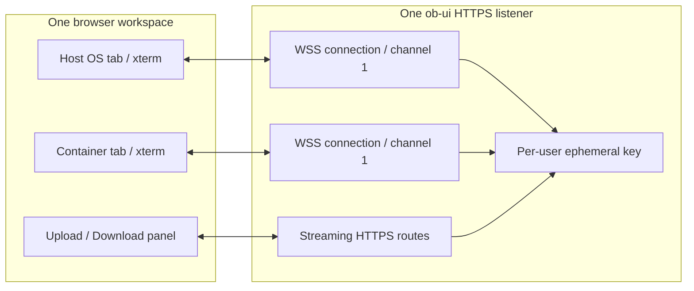

Switching tabs hides, but does not unmount, the inactive terminal. Closing a tab tears down only its connection.
Expanding the workspace changes the existing subtree to a fixed, full-browser-viewport layout; it does not open a second
dialog, request native browser fullscreen, or reconnect terminals. Collapse and Escape restore the dashboard layout.
Only visible terminals are fitted to their current dimensions. The title bar retains the device name when expanded. Host
OS is listed first in the target picker, followed by App services and then supported Supervisor services, in the same
order as the dashboard tables. Service-name-based colored badges are shared by those tables, terminal targets, terminal
tabs, and the logs container picker.

The tab label is captured from the target used to connect, not recomputed from subsequent picker snapshots. A temporary
target-list omission or service rename therefore cannot relabel an active container shell as Host OS. Disconnecting
releases that session label; a new connection captures its current target label.

The terminal's measurement and rendering elements use the same monospace font stack. A scoped override isolates xterm
from the application's universal proportional-font rule; otherwise xterm's fixed-width cell layout produces uneven
spacing even though the terminal options specify a monospace font.

On managed device dashboards, service presentation consumes the refresh owner's live install records and
loading/error state. Its image metadata lookup is keyed from those current records, including newly installed releases.
The separate legacy installation query is disabled there; independent widgets without a matching owner retain their
own adaptive querying. External start/stop/release changes consequently flow into service statuses, running targets,
and log-source choices.

Connection cancellation uses both an abort signal for ticket requests and an attempt-generation guard so late async
results cannot create a socket after cancellation or unmount. Browser-initiated WebSocket closes use code `1000`:
browser callers cannot send the protocol-reserved `1002` or `1011` codes. Server-originated error text is retained in
the affected tab. Failed channel opens produce channel-scoped `error` and `closed` messages; device access is checked
again for every `open`, even after ticket authentication.

## Terminal protocol

WebSocket supplies framing but not independent logical streams. The application protocol therefore has an explicit
version and channel identifier.

Control messages are JSON with `v: 1`:

| Type        | Direction         | Purpose                                          |
| ----------- | ----------------- | ------------------------------------------------ |
| `auth`      | browser to server | Consume a ticket in the first message            |
| `ready`     | server to browser | Confirm ticket authentication                    |
| `open`      | browser to server | Open a host or validated container terminal      |
| `opened`    | server to browser | Confirm SSH channel creation                     |
| `resize`    | browser to server | Set PTY rows and columns                         |
| `exit`      | server to browser | Report remote exit code or signal                |
| `close`     | browser to server | Request logical channel closure                  |
| `closed`    | server to browser | Confirm logical channel closure                  |
| `error`     | server to browser | Non-secret failure, optionally scoped to channel |
| `heartbeat` | both              | Optional application heartbeat and nonce echo    |

New container `open` messages carry `containerKind: "service"` or `"supervisor"` alongside `container`. Service selectors
use the service-name label, including an App service literally named `balena_supervisor`; Supervisor selectors require
the canonical `balena_supervisor` name. Host targets cannot carry a container kind. Invalid kinds and incompatible
combinations are rejected rather than silently selecting another container.

For older clients only, omitting `containerKind` preserves the legacy reserved-name mapping of `balena_supervisor` to
Supervisor core. The current UI always sends an explicit kind for container targets, eliminating that name ambiguity.

Terminal input/output are binary WebSocket messages: a four-byte unsigned big-endian channel ID followed by the raw
terminal bytes. Channel-scoped control messages include `channel`; connection-level messages do not. The browser uses an
incremental UTF-8 decoder per terminal so multibyte characters split across frames are preserved. Numeric dimensions,
lengths, and channel IDs are bounded before allocation. Server WebSocket ping/pong frames also detect dead peers.

### Flow control

SSH already has per-channel windows. Browser WebSocket does not provide receive-side backpressure. The implementation
therefore pauses an SSH output stream when WebSocket `bufferedAmount` crosses its high-water threshold and polls until
the queue returns to the low-water threshold. In the browser, terminal output is written incrementally to xterm. For
browser-to-device input, the server pauses the underlying WebSocket transport while any SSH channel reports backpressure
and resumes it only after every blocked channel drains.

Terminal traffic is never multiplexed with file bytes. Bulk transfers use HTTP so they cannot starve interactive output.

### Idle sessions and keepalives

There is no terminal typing/output inactivity deadline. Two different network hops require independent keepalives:

- **Browser to ob-ui:** the server sends WebSocket ping frames every 30 seconds. The browser's WebSocket implementation
  answers with pong frames automatically, including when a terminal tab is hidden. If a previous ping remains unanswered
  at the next probe, the server terminates that dead WebSocket and closes its SSH channels.
- **ob-ui through the CONNECT tunnel to the device:** `ssh2` sends SSH-level keepalive requests every 30 seconds. This
  is essential because browser WebSocket ping/pong does not produce any traffic through the upstream CONNECT tunnel.
  Without SSH probes, an idle tunnel can be dropped by proxy/network inactivity limits even while the browser remains
  connected. Three consecutive unanswered SSH probes cause transport failure and cleanup; a responsive but otherwise
  idle SSH transport stays open.

An open shell retains an active ephemeral-key reference regardless of typing activity. The configurable key-idle timer
(10 minutes by default) starts only when the user's last shell or transfer releases its reference. Closing/refreshing
the browser, losing its connectivity, explicitly closing a terminal tab, or a real SSH/device failure releases
references. Keepalives cannot preserve a shell across a device restart, a broken network, or an explicit remote shell
exit.

The automated regression runs a real SSH server through a local CONNECT proxy with a short idle timeout, scales only the
test's probe interval, verifies the connection survives beyond that timeout without shell input, and verifies its key
and operation quota are retained until closure.

### Container terminals

Container names are validated against a narrow character and length policy. They are never concatenated into an
arbitrary shell command. The server invokes only the fixed, documented balena container-entry operation with the
validated name. Arbitrary command selection is outside the browser protocol.

The Supervisor-group `core` target uses `containerKind: "supervisor"` with `container: "balena_supervisor"`, while App
services use `containerKind: "service"` with their service name. The Supervisor target resolves only the exact canonical container
name `balena_supervisor`, independently of application service labels. An App service labelled `core` therefore cannot
capture Supervisor terminals or transfers, including when the Supervisor itself has no service-name label.
The logs picker likewise distinguishes
Supervisor core from an App service named core: it includes that core service's tagged messages and untagged/default
Supervisor entries, without including other application messages.

## Device log viewer

Logs use the existing openBalena `GET /device/v2/<uuid>/logs` API with the logged-in user's bearer token. They do not
travel over terminal WebSockets, open an SSH connection, or acquire an ephemeral SSH key. Keeping the log viewer active
therefore does not postpone SSH-key cleanup after the user's last shell/file operation ends.

The dashboard's device-scoped selection provider is shared by the App/Supervisor checklist menus and the service-table
log buttons. Buttons toggle sources rather than replacing all other selections. Host OS appears first in the Supervisor
checklist, followed by the Supervisor services in dashboard order. Group checkboxes select/deselect all their sources.
Returning to **Select Container (clear selection)**, or unchecking every source, immediately empties the window and
stops polling. A new device starts with no selected sources.

While sources are selected, one non-overlapping polling loop fetches the API's combined snapshot immediately and then
approximately two seconds after each request completes. Selected-source filtering happens in the browser, so the number
of API requests does not grow with the number of selected sources. Requests are aborted and timers removed when the
viewer unmounts, the device changes, or all sources are deselected. Failures appear explicitly in an alert; repeated
identical errors do not flood the console.

Numeric millisecond timestamps and ISO timestamps are normalized to ISO. Snapshots are merged in chronological order,
deduplicating already captured entries while preserving repeated identical entries within a snapshot. Overlapping Host
OS/default Supervisor-core selections do not duplicate physical log entries. The browser retains at most 5,000 entries
and prevents evicted history from being replayed. This is a bounded tail viewer: messages lost from the API's tail
between polls cannot be recovered, and a download is not a complete historical device-log archive.

Rendering is React text and styled spans, never log-supplied HTML. ANSI SGR colors, bold/italic/dim styles, and
indexed/RGB colors are preserved; other terminal controls and OSC links are stripped. JSON `level`/`severity` fields
supply fallback severity colors when a container emits structured logs without ANSI. Stderr and system flags continue
supplying their existing error/warning colors. All content spans use the same monospace stack, isolated from the global
app font rule.

**Clear logs** empties the captured buffer and records a timestamp cutoff at least as recent as the newest displayed
entry and the browser's current clock. Old snapshots and in-flight responses cannot repopulate pre-clear history. The
cutoff survives source changes, including deselecting/reselecting all sources, and resets on viewer reload/device
change. Accurate device/browser clocks are required for time-based clear and timestamp filters. Scrolling upward pauses
automatic bottom-follow; scrolling back to the bottom resumes it.

**Download displayed logs** creates a browser-only UTF-8 text download containing the currently selected and filtered
entries, with ISO timestamp and source labels. ANSI controls are excluded from exported text. Nothing is staged on
ob-ui.

Free-text search matches message substrings without case sensitivity. An added filter is an OR group of alternatives;
multiple filter groups and free-text search are ANDed. Message operators support contains/not contains, equality/
inequality, starts-with/not starts-with, and ends-with/not ends-with. Timestamp operators support before, after,
equality, and inequality. Local-time inputs are converted to timezone-qualified ISO timestamps. Invalid filters are
rejected with visible validation errors. Active filter chips can be edited or deleted.

## Streaming uploads

The UI requires:

- a local file picker;
- a required device target-path text field;
- explicit start/cancel controls;
- progress and terminal error status.

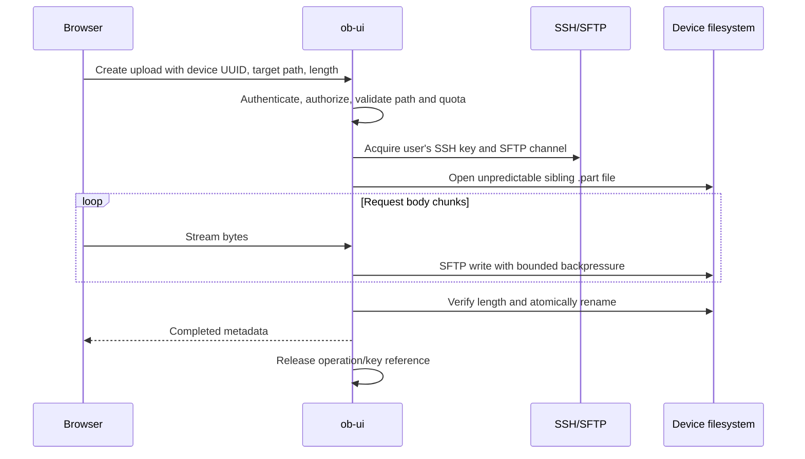

The server does not use Express JSON/body buffering on upload byte routes. Request bodies flow through a bounded
counting/validation transform into an SFTP write stream. Cancellation destroys both sides of the pipeline.

The browser sends the selected `File` directly as the XMLHttpRequest body with bearer authentication. Upload progress
reports bytes sent by the browser, not an acknowledgement that the device has committed them. Completion is shown only
after the server returns success. The selected filename and size are displayed separately from the compact action
buttons. Upload and download paths and filesystem selections are independent. Both selections default to Host OS and
are independent of the active terminal tab. They use the identical target list and badge renderer as the terminal
picker: Host OS, running App services, then running supported Supervisor services. The active mode displays either
**Upload to** or **Download from** without changing the other mode's selection;
paths are absolute inside the selected filesystem. Target/mode changes are disabled during a transfer. If a selected
container stops, another target must be selected explicitly: transfers never silently fall back to Host OS.

### Container filesystem targeting

Both HTTP transfer routes accept optional validated `container` and `containerKind` query parameters. Omitting both
retains Host OS paths. Container kinds have the same explicit service/Supervisor semantics and older-client fallback
as terminal `open` messages.
Authorization, human-user SSH authentication, quotas, host verification, key reuse, and the SFTP streaming pipeline are
unchanged. For container transfers, ob-ui resolves the same service label/explicit Supervisor selector used by
terminals, then asks the host engine for the running container's process ID over an SSH exec channel. Invalid/zero PIDs,
missing containers, exec failures, excessive output, timeout, and cancellation are explicit failures.

Host SFTP accesses the Linux process filesystem through `/proc/<pid>/root`, including the container's mounted volumes;
no SSH/SFTP daemon, helper binary, or shell needs to be installed in the container image. Paths are resolved component
by component with SFTP `lstat`/`readlink`. Absolute symlinks restart at the **container** root rather than the host
root, relative links are normalized within that root, and more than 40 symlinks fail. Only a missing final component is
accepted for creating a new upload; missing parents and permission errors are surfaced. The unpredictable upload partial
and final rename occur in this resolved container filesystem.

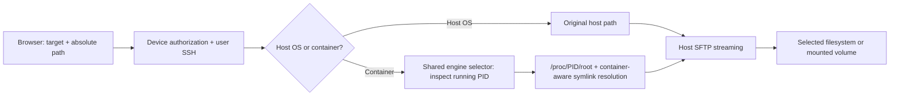

This requires balenaOS/Linux procfs and host SSH/SFTP permission to traverse the selected process root. Access retains
the host SSH session's Unix privileges, not the container's configured Unix user; the existing host-access authorization
is therefore still the security boundary. This is filesystem targeting, not a container sandbox. A restart/removal can
invalidate the selected process root and interrupt a transfer; reselect/retry against the new running instance.

The initial implementation streams one HTTP request into an unpredictable sibling `.part` path, verifies the received
length when the browser supplied one, and renames the partial file to the requested target only after success. It
removes the partial file after an error or cancellation and rejects a target that already exists during preflight. It
does not claim restart-resumable upload semantics. A later resumable protocol may persist confirmed remote offsets, but
any persisted state must contain only metadata, never file content. Multi-replica resumability would also require shared
metadata and a distributed lock for each upload ID.

## Streaming downloads

The UI requires:

- a required device source-path text field;
- explicit download/cancel controls;
- visible errors.

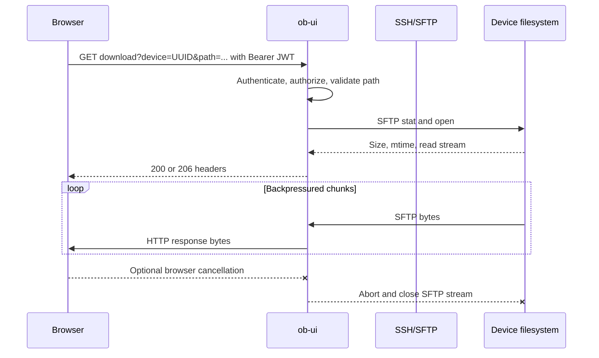

Downloads support `HEAD`, a single `Range`, `206`, `Content-Range`, and `416`. The browser receives a safe
`Content-Disposition` filename. The current implementation does not supply a strong ETag or implement `If-Range`, so a
caller must not combine ranged responses when the remote file may have changed.

On browsers supporting `showSaveFilePicker`, the Download click opens the native save picker before any asynchronous
work, preserving user activation. The authenticated response stream passes through a byte-counting transform into the
chosen file's writable stream. Cancellation aborts the fetch and the writable pipeline. Cancelling the picker is shown
as cancellation, not a connection failure.

This ordering deliberately means that missing-file, permission, authorization, tunnel, SSH, and SFTP errors can appear
**after** the destination picker, for either Host OS or container sources. The response is validated before the chosen
file's writable stream is opened, so remote validation failures do not start writing downloaded bytes. Waiting for an
asynchronous remote check before invoking the picker risks losing the browser's transient user activation. A robust
check-first flow would require a second explicit Save click, or a debounced background pre-check that adds remote
requests and still cannot eliminate a check/download race. The current UX retains the single-click flow without
background checks on source-path edits.

If that API is unavailable, the UI explicitly explains that the complete download is held in **browser memory** before
an object-URL download is triggered. This fallback still never stages bytes on ob-ui disk, but is not a bounded-memory
browser download and is unsuitable for very large files. Progress and Cancel controls are shared by the two modes; mode
switching is disabled during an active transfer.

SFTP is required. The implementation does not silently fall back to interpolated `cat`, `dd`, `tar`, or legacy SCP
commands. If a device lacks SFTP, the API returns an explicit capability error.

## Remote path policy

Every upload target and download source is entered as text, but it is not trusted.

The server:

- rejects empty paths, NUL bytes, control characters, and excessive length;
- requires the configured absolute-path policy;
- normalizes separators according to the remote POSIX filesystem;
- rejects `.` and `..` traversal components;
- uses SFTP operations rather than shell interpolation;
- rejects an upload target that already exists at the preflight check.

Client-side validation exists for usability only. Server-side validation is authoritative.

## Security boundaries

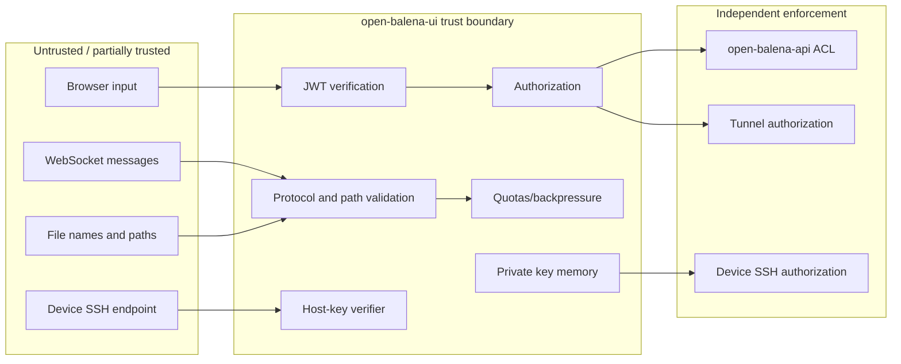

### Secrets

The following are secrets:

- user JWT;
- tunnel proxy authorization value;
- ephemeral SSH private key;
- single-use WSS ticket before consumption.

They must not appear in URLs, application logs, audit records, thrown error messages, telemetry labels, subprocess
arguments, or environment variables.

### Resource controls

The server enforces configurable bounds for:

- active users and SSH connections;
- connections and channels per user/device;
- WebSocket frame and queued-byte size;
- terminal input rate;
- terminal idle and maximum duration;
- upload size and duration;
- simultaneous transfers;
- CONNECT response header size;
- path and container-name length.

### CSRF and cross-origin WebSockets

Bearer-protected HTTP routes require the authorization header and do not rely on ambient cookies. WebSocket upgrades
additionally enforce exact allowed Origin and a single-use ticket. Authentication does not replace per-message
authorization or schema validation.

## Failure and cleanup behavior

| Failure                         | Required behavior                                                            |
| ------------------------------- | ---------------------------------------------------------------------------- |
| JWT invalid/expired             | Reject before allocating key, tunnel, or SSH resources                       |
| Device access denied            | Return 403 without exposing upstream details                                 |
| Key registration fails          | Release private-key state and return explicit upstream failure               |
| Tunnel TLS/CONNECT fails        | Close socket, release key reference, return sanitized error                  |
| SSH host key missing/mismatched | Fail closed unless the explicit unverified compatibility policy applies      |
| SSH authentication fails        | Close transport and retain key only according to active/idle lifecycle       |
| Browser WSS disconnects         | Close its SSH channels and decrement references                              |
| Upload disconnects              | Abort pipeline, close handle, apply partial-file policy                      |
| Download disconnects            | Destroy SFTP read stream and release resources                               |
| SFTP unsupported                | Return explicit capability error                                             |
| Server shutdown                 | Stop upgrades, close channels/transports, attempt key-row cleanup, then exit |

No error is converted into a success-shaped empty terminal or file response.

## Multi-replica deployment

An in-memory ticket/key/session manager is correct only when the same process handles session creation and WebSocket
upgrade and when transfer resume need not survive replacement. Multiple replicas require:

- sticky routing for WSS or a shared atomic ticket store;
- a defined owner for each SSH connection;
- orphan key cleanup that is safe across replicas;
- graceful pod draining.

SSH sockets themselves cannot migrate between processes. A replaced pod closes its terminals and interrupts active
uploads and downloads; the current upload protocol restarts from byte zero.

## Configuration

The implementation recognizes the following remote-access settings. Exact parsing and defaults are tested in server
code.

| Variable                                     |             Default | Purpose                                                                      |
| -------------------------------------------- | ------------------: | ---------------------------------------------------------------------------- |
| `REACT_APP_OPEN_BALENA_REMOTE_URL`           |               empty | Non-empty selects the legacy remote service                                  |
| `OPEN_BALENA_TUNNEL_URL`                     |                none | HTTPS tunnel, or explicit HTTP CONNECT endpoint on a trusted private network |
| `OPEN_BALENA_SSH_TARGET_PORT`                |             `22222` | Device SSH port requested through CONNECT                                    |
| `OPEN_BALENA_SSH_KEY_IDLE_TTL_MS`            |            `600000` | Delay after the final operation before deleting a user's ephemeral key       |
| `OPEN_BALENA_SSH_HOST_KEYS`                  |                none | Device/wildcard SHA-256 host-key pins                                        |
| `OPEN_BALENA_SSH_ALLOW_UNVERIFIED_HOST_KEYS` |             `false` | Compatibility escape hatch for old/unmanaged device host keys                |
| `OPEN_BALENA_REMOTE_ALLOWED_ORIGINS`         | ob-ui origin policy | Explicit additional browser origins for WSS                                  |
| `OPEN_BALENA_REMOTE_PUBLIC_ORIGIN`           |                none | Browser-facing origin for TLS-terminating proxies; otherwise use direct socket origin |
| `OPEN_BALENA_REMOTE_TRUSTED_PROXIES`         |                none | Trusted proxy IPs/CIDRs for HTTP and WebSocket client-address resolution       |
| `OPEN_BALENA_REMOTE_CONNECT_TIMEOUT_MS`      |             `15000` | Tunnel/SSH timeout and per-request key-store HTTP deadline including body     |
| `OPEN_BALENA_REMOTE_TICKET_TTL_MS`           |             `30000` | Single-use WebSocket ticket lifetime                                         |
| `OPEN_BALENA_REMOTE_MAX_PENDING_TICKETS_PER_USER` |                `8` | Maximum unconsumed terminal tickets per user                                 |
| `OPEN_BALENA_REMOTE_MAX_PENDING_TICKETS`     |              `1024` | Maximum unconsumed terminal tickets per server process                       |
| `OPEN_BALENA_REMOTE_MAX_OPERATIONS_PER_USER` |                 `8` | Simultaneous terminals/transfers per user                                    |
| `OPEN_BALENA_REMOTE_MAX_WEBSOCKETS_PER_IP`   |                 `8` | Pre-authentication WebSocket bound per resolved client IP                     |
| `OPEN_BALENA_REMOTE_MAX_CHANNELS_PER_SOCKET` |                 `4` | Logical terminal channels per WebSocket                                      |
| `OPEN_BALENA_REMOTE_MAX_MESSAGE_BYTES`       |           `1048576` | Maximum WebSocket message size                                               |
| `OPEN_BALENA_REMOTE_MAX_UPLOAD_BYTES`        |        `1073741824` | Maximum accepted upload length                                               |
| `OPEN_BALENA_REMOTE_MAX_PATH_BYTES`          |              `4096` | Maximum UTF-8 byte length of a remote path                                   |

Built-in mode must refuse to start a remote operation with a clear configuration error when its tunnel endpoint or
required authorization dependencies are missing. The rest of open-balena-ui remains available.

### Trusted proxies and connection bounds

Without `OPEN_BALENA_REMOTE_TRUSTED_PROXIES`, the transport peer is the client address and forwarded IP headers are
ignored. Behind a reverse proxy, list only its trusted IPs/CIDRs. HTTP rate limiting and WebSocket connection accounting
then use the same trusted-hop policy: traverse from the actual socket peer and stop at the nearest untrusted address.
A spoofed leftmost forwarded value cannot override that boundary. Blanket trust-all CIDRs are rejected.

WebSocket addresses are resolved once before upgrade, validated, and retained for increment/decrement accounting.
Browsers with different resolved client IPs no longer share an ingress address's eight slots. The limit remains a
pre-authentication bound, not a substitute for per-user operation quotas. Genuine shared NATs still share one bucket;
operators can raise `OPEN_BALENA_REMOTE_MAX_WEBSOCKETS_PER_IP` to accommodate that deployment.
Proxy address trust does not infer the public HTTPS origin; TLS-terminating deployments must still configure
`OPEN_BALENA_REMOTE_PUBLIC_ORIGIN`.

## Audit and observability

If the existing deployment has an appropriate event/audit sink, record:

- stable user ID and canonical username;
- device UUID and host/container target;
- operation type and random correlation ID;
- start/end timestamps and termination reason;
- bytes transferred;
- SSH host-key and ephemeral public-key fingerprints;
- authorization outcome.

Do not record terminal input/output, file content, JWTs, private keys, proxy credentials, or WSS tickets. If no suitable
durable audit store exists, rely on tunnel/device SSH authentication logs and normal structured application operational
logs rather than inventing a database table without a retention and privacy policy.

Operational metrics should include active SSH transports/channels, queued terminal bytes, connection latency by phase,
transfer throughput, abort counts, key cleanup failures, host-key failures, and errors by sanitized category.

## Deployment and rollback

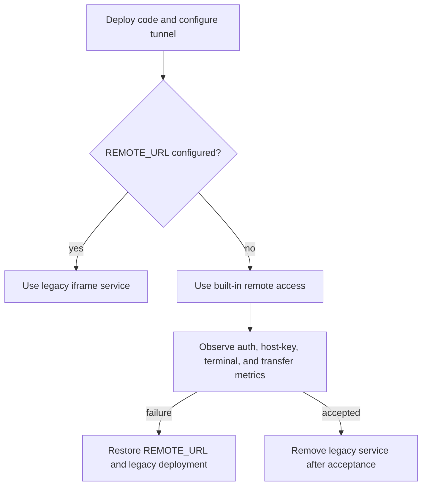

Rollback consists of restoring `REACT_APP_OPEN_BALENA_REMOTE_URL` and keeping the legacy service reachable. No database
migration is required. Temporary key rows use their own reserved titles and do not replace user-managed keys.

After acceptance:

1. remove the legacy remote deployment and external port range;
2. remove any obsolete `open-balena-remote` key rows;
3. retain the compatibility selector only as long as supported deployments require it;
4. design HTTP-service and VNC proxying as separate protocol extensions.

## Testing strategy

### Unit tests

- configuration parsing and secure defaults;
- device UUID, container name, Origin, and path validation;
- ticket expiry, binding, and atomic consumption;
- terminal message parsing and bounds;
- HTTP CONNECT response parsing;
- host-key pin matching and mismatch behavior;
- byte range parsing and response calculation;
- key acquire/release/timer transitions;
- sanitization of surfaced errors.

### Integration tests with mocked boundaries

- JWT authorization before any remote allocation;
- canonical username resolution;
- device-access denial;
- public-key create/delete requests;
- tunnel success and non-200 responses;
- SSH/channel close propagation;
- upload and download backpressure/cancellation;
- no file-system staging calls.

### Deployment acceptance

Live development acceptance on device 25 verified host SSH, simultaneous host and `ugshell` terminals, independent tab
closure, expansion/collapse preserving the same terminal DOM and connections, and connection-error recovery. A small
upload/download round trip verified exact content, ranged reads, duplicate-target rejection, missing-source errors, and
cleanup of the scratch files. The redesigned Download control's streamed-save path was tested with a recording writable
sink in place of the native OS save dialog. This does not replace a manual native-dialog test or large-file and
supported-device-version acceptance.

Follow-up acceptance verified equal-width monospace character measurement, the device name in the expanded title,
matching App/Supervisor order and badge colors in the terminal and logs pickers, and a working canonical Supervisor
`core` shell. Simultaneous Host OS and Supervisor core shells remained connected for 370 seconds with no terminal input
or output; both successfully executed a command afterward. Closing core's tab left Host OS connected. This validates
survival beyond the reported three-to-five-minute idle disconnect window, not immunity to genuine transport failures.

The broader deployment acceptance matrix remains:

- oldest and newest supported balenaOS versions;
- simultaneous terminals across users and devices;
- sequential operations reusing one user's key;
- key removal after the configured idle delay;
- browser refresh and network interruption;
- large slow upload/download with bounded server memory;
- Range handling and documented changed-source limitation;
- changed/unknown host key;
- SFTP-unavailable device;
- pod graceful shutdown and restart;
- legacy selection when `REACT_APP_OPEN_BALENA_REMOTE_URL` is restored.

## Known limitations

- Device SSH logs can identify the openBalena username but do not provide complete command auditing.
- Container Unix identity usually remains the container user/root.
- Devices that accept only generic `root` keys cannot truthfully log the human SSH username without a device-side
  authentication change.
- Devices without SFTP cannot use built-in file transfer.
- In-memory SSH connections do not survive process replacement.
- JavaScript cannot guarantee physical zeroization of released key memory.
- HTTP and VNC service proxying remain legacy-only in this release.

## Primary references

- [balena CLI tunnel implementation](https://github.com/balena-io/balena-cli/blob/master/src/utils/tunnel.ts)
- [balena CLI device SSH implementation](https://github.com/balena-io/balena-cli/blob/master/src/commands/device/ssh.ts)
- [openBalena VPN authorization](https://github.com/balena-io/open-balena-api/blob/master/src/features/vpn/services.ts)
- [openBalena host OS authorization](https://github.com/balena-io/open-balena-api/blob/master/src/features/host-os-access/access.ts)
- [openBalena public-key lookup](https://github.com/balena-io/open-balena-api/blob/master/src/features/auth/public-keys.ts)
- [balena SSH access documentation](https://docs.balena.io/learn/manage/ssh-access)
- [RFC 4254: SSH connection protocol](https://www.rfc-editor.org/rfc/rfc4254)
- [RFC 6455: WebSocket protocol](https://www.rfc-editor.org/rfc/rfc6455)
- [RFC 9110: HTTP range semantics](https://www.rfc-editor.org/rfc/rfc9110.html#section-14)
- [ws](https://github.com/websockets/ws)
- [ssh2](https://github.com/mscdex/ssh2)
- [xterm.js](https://github.com/xtermjs/xterm.js)
- [OWASP WebSocket Security Cheat Sheet](https://cheatsheetseries.owasp.org/cheatsheets/WebSocket_Security_Cheat_Sheet.html)
