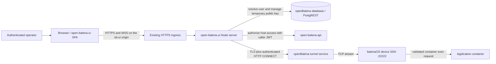
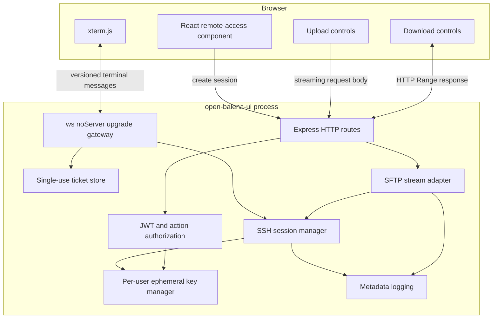
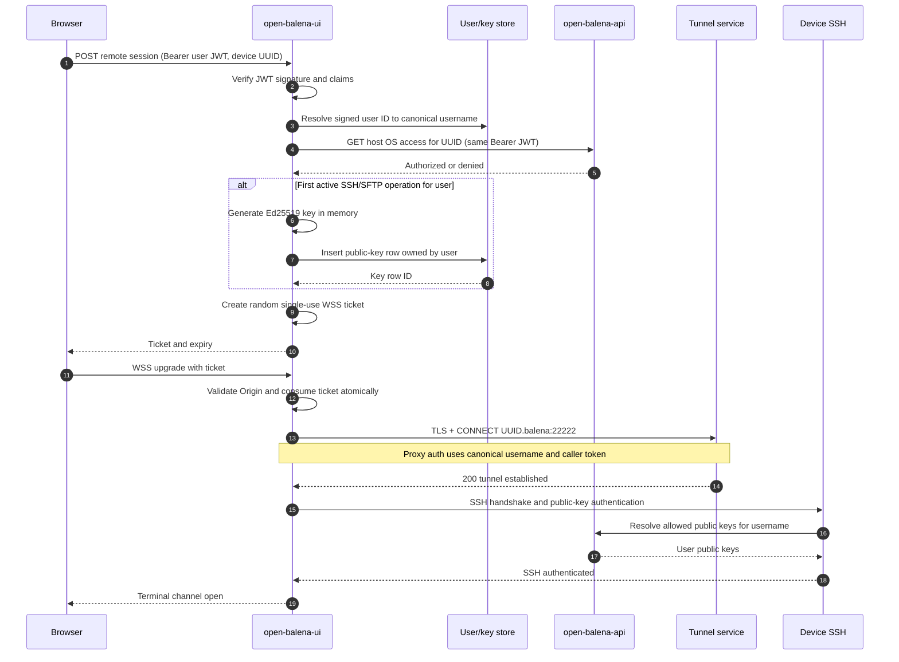
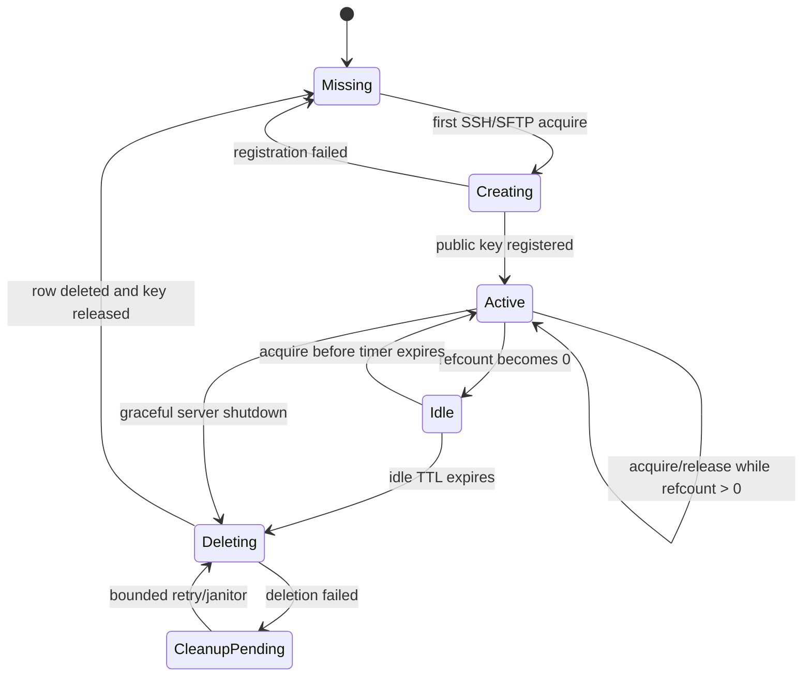
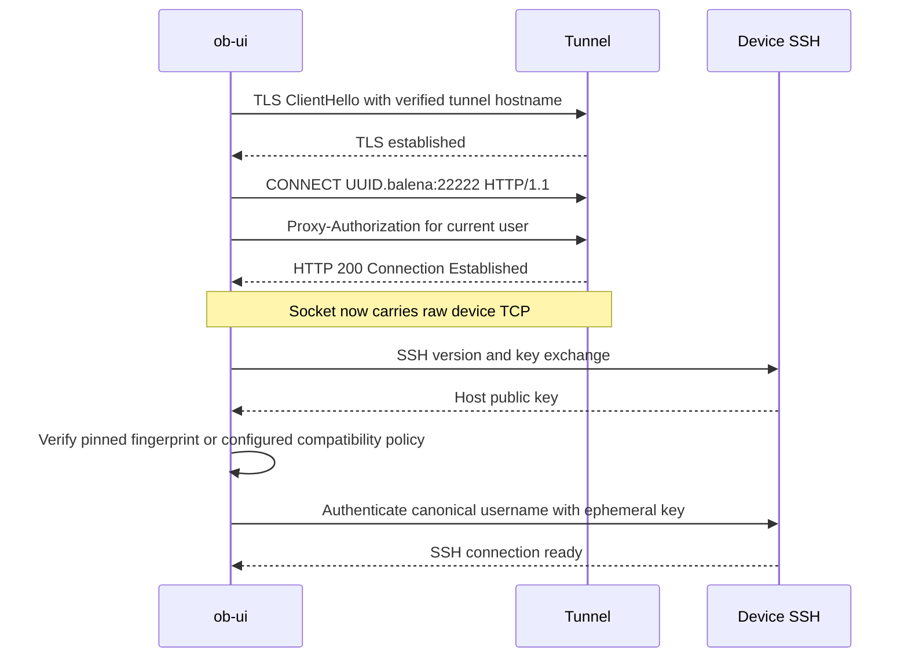
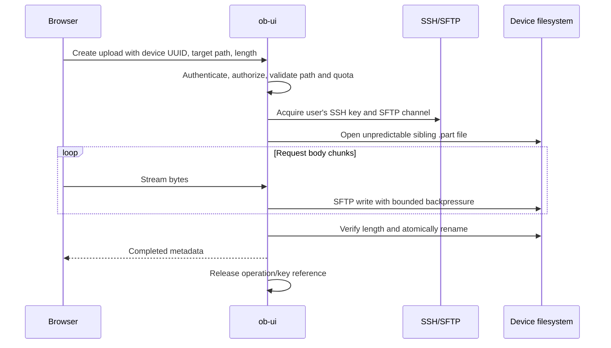
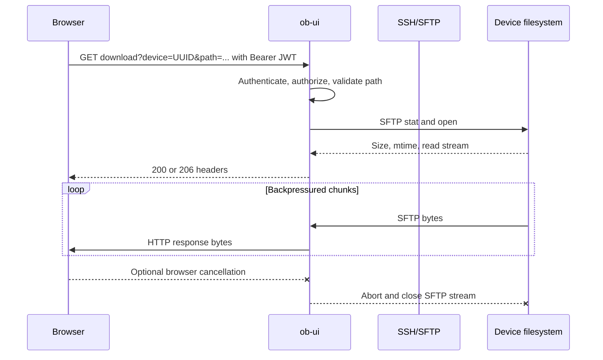
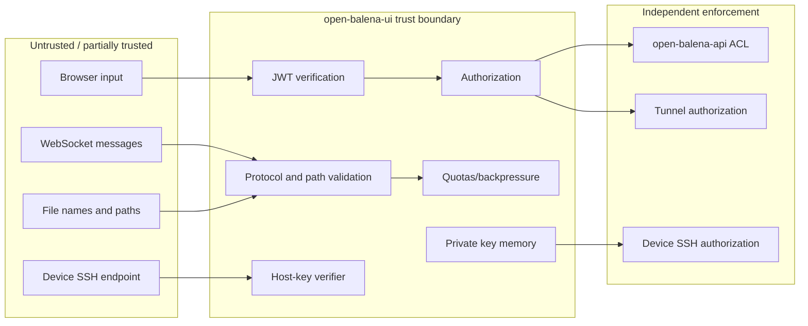
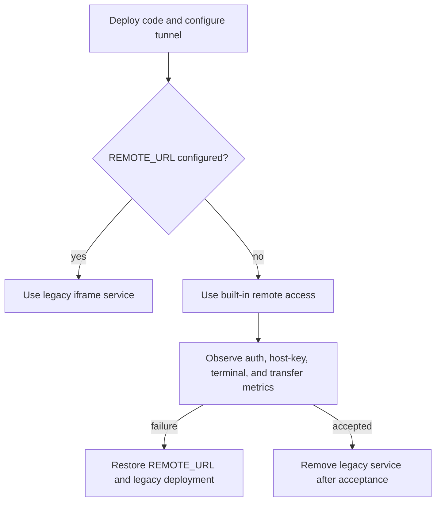

# Built-in Remote Access Architecture

## Purpose and scope

This document is the authoritative design and operations reference for terminal and file access from open-balena-ui to
managed devices.

The built-in implementation replaces the terminal and SSH/SFTP responsibilities of `ob-community/open-balena-remote`. It
deliberately does not replace HTTP-service or VNC proxying yet. Those services continue to require the legacy remote
service when configured.

The built-in implementation provides:

- interactive host and application-container terminals in the browser;
- one public HTTPS/WSS listener shared by every browser and device session;
- authenticated outbound SSH through the existing openBalena tunnel endpoint;
- one reusable, short-lived SSH key per active open-balena-ui user;
- direct, non-staging SFTP uploads and downloads;
- explicit trust, authorization, resource, and lifecycle boundaries.

The compatibility rule is simple:

| `REACT_APP_OPEN_BALENA_REMOTE_URL` | Behavior                                          |
| ---------------------------------- | ------------------------------------------------- |
| Non-empty valid HTTP(S) URL        | Use the legacy iframe-based remote service        |
| Empty or absent                    | Use the built-in terminal and SFTP implementation |

This makes rollback possible without shipping a second UI build.

## Design principles

1. **One public port, not one process or listener per session.** Browser traffic uses the existing ob-ui HTTPS origin.
   No terminal allocates a public or loopback TCP listening port.
2. **The authenticated human remains the SSH identity.** Different users never share an authenticated SSH transport.
3. **Credentials are not browser URL state.** JWTs, private keys, proxy credentials, and reusable WebSocket credentials
   never appear in query strings.
4. **File bytes are streamed.** ob-ui applies bounded backpressure but never stores complete files or transfer fragments
   on its filesystem.
5. **Authorization is checked at the action boundary.** Establishing a browser session does not grant unrestricted
   future access.
6. **Trust failures are visible.** Invalid tokens, denied devices, tunnel failures, changed host keys, missing SFTP
   support, invalid paths, and exhausted quotas produce explicit errors.
7. **Compatibility exceptions are opt-in.** Host-key verification is strict unless an operator deliberately enables the
   legacy-device escape hatch.

## System context



### Public and private network paths

Only the existing ob-ui origin is browser-facing. The ob-ui pod connects to the tunnel service through its internal
Kubernetes service name when available. It does not need to join the device VPN and does not connect directly to device
VPN addresses.

The operator's workstation-equivalent flow:

```text
proxytunnel -> tunnel endpoint -> CONNECT <uuid>.balena:22222 -> SSH
```

becomes an in-process protocol flow:

```text
Node TLS socket -> CONNECT <uuid>.balena:22222 -> ssh2
```

No `proxytunnel`, balena CLI, OpenSSH client, ttyd, websockify, or per-session child process is required for host
terminals or SFTP.

## Components and responsibilities



### Express HTTP routes

The built-in service uses the existing Node listener. Express continues serving all existing API and static-client
routes. Remote-access HTTP routes are mounted before the SPA catch-all route.

Responsibilities:

- bearer-token verification;
- device authorization;
- issuing single-use WebSocket tickets;
- upload request validation and streaming;
- download metadata, range validation, and streaming;
- consistent error responses without credential disclosure.

### WebSocket gateway

The Node HTTP server owns one `upgrade` handler. Only the documented remote WebSocket path is accepted. The gateway:

- validates the exact request path and configured browser Origin;
- atomically consumes a short-lived ticket;
- applies connection, message, and queue limits;
- parses the versioned protocol;
- maps logical terminal channels to SSH channels;
- performs heartbeat and dead-peer cleanup.

### Ephemeral key manager

The key manager owns private-key material and public-key database records.

Its cache key is the authenticated openBalena user ID. One key may support many simultaneous and sequential operations
by that same user. It is never shared with another user.

Each entry contains:

- user ID and canonical username;
- private key held only in process memory;
- public key and fingerprint;
- unique database row ID/title;
- active operation reference count;
- last release time;
- pending cleanup timer.

### SSH session manager

The session manager opens TLS HTTP CONNECT sockets and passes them to `ssh2`. Its responsibilities are:

- tunnel handshake and response validation;
- SSH authentication as the canonical username;
- SSH host-key verification;
- opening PTY, shell, container, and SFTP channels;
- per-user, per-device, and global quotas;
- cancellation, idle timeout, error propagation, and shutdown.

An SSH transport may multiplex channels belonging to one authenticated user/device session. It must never carry channels
for different users.

## End-to-end authentication and authorization

There are three separate authentication events. They are intentionally not conflated.



### Browser-to-ob-ui authentication

Normal HTTPS requests use the existing bearer JWT in the `Authorization` header. The existing server middleware verifies
the signature with `OPEN_BALENA_JWT_SECRET` and restricts the accepted algorithm.

Native browser WebSockets cannot set an arbitrary `Authorization` header. The browser therefore first makes an
authenticated HTTPS request. ob-ui returns a cryptographically random, single-use, short-lived ticket. The ticket is:

- stored only in memory unless multi-replica deployment requires a shared store;
- bound to user ID, device UUID, and expected Origin;
- expired after a short interval;
- consumed atomically during upgrade;
- useless after first use.

The user JWT is never placed in the WebSocket URL.

### Device authorization

Before allocating a key or tunnel, ob-ui calls the openBalena host-OS access endpoint using the same user bearer token.
A successful UI login alone is not sufficient. Each terminal, upload, and download is authorized for its requested
device.

### Tunnel proxy authentication

The tunnel connection uses the current user's canonical username and token as required by the openBalena tunnel
protocol. The tunnel enforces access to the requested device UUID.

Tunnel authorization is defense in depth and does not replace the explicit host-access call.

### SSH authentication

SSH authenticates as the canonical openBalena username using the in-memory private key. The device retrieves that
username's public keys through openBalena. Consequently, compatible device/tunnel authentication logs identify the human
user rather than a shared `obui` account.

Container processes generally run as the container's configured Unix user or root. The human identity is preserved at
the SSH boundary; it is not automatically propagated into the container's `/etc/passwd` identity or shell command
history.

## Ephemeral key lifecycle



The default idle delay is ten minutes. Operators can change it with `OPEN_BALENA_SSH_KEY_IDLE_TTL_MS`. The timer starts
only when the final terminal or transfer using the key releases its reference. A new operation cancels the timer and
reuses the key.

Every key row has a unique ob-ui-specific title containing a non-secret session identifier. This avoids overwriting
user-managed keys and supports cleanup. Normal cleanup deletes the exact row ID created by the manager. Startup/periodic
orphan cleanup may delete only rows bearing the reserved prefix and old enough to exceed the documented safety interval.

JavaScript cannot guarantee physical memory zeroization. The implementation minimizes private-key lifetime, never
serializes it outside the SSH library boundary, and releases all references after cleanup.

## Tunnel and SSH establishment



The CONNECT parser accepts only a bounded HTTP response header and requires a successful status. Proxy credentials and
the caller JWT are redacted from every error.

## SSH host-key trust

Strict verification is the default. Operators should configure pinned SHA-256 SSH host-key fingerprints, preferably per
device. A wildcard pin may be used only when the deployment intentionally uses one host key across a managed fleet.

The compatibility option `OPEN_BALENA_SSH_ALLOW_UNVERIFIED_HOST_KEYS=true` permits connection when no matching pin is
available. It exists only for old devices and migrations. It restores the trust weakness of the legacy implementation
and should be temporary, narrowly deployed, and monitored.

A changed configured fingerprint always fails. The compatibility option must not silently override an explicit
mismatching pin.

Long term, a deployment-managed SSH host CA is preferable to individual pins if balenaOS provisioning can supply host
certificates.

## Terminal protocol

WebSocket supplies framing but not independent logical streams. The application protocol therefore has an explicit
version and channel identifier.

Representative control messages:

| Type          | Direction         | Purpose                                     |
| ------------- | ----------------- | ------------------------------------------- |
| `open`        | browser to server | Open a host or validated container terminal |
| `opened`      | server to browser | Confirm SSH channel creation                |
| `input`       | browser to server | Terminal input                              |
| `output`      | server to browser | Terminal output                             |
| `resize`      | browser to server | Set PTY rows and columns                    |
| `exit`        | server to browser | Report remote exit code or signal           |
| `close`       | both              | Close one logical channel                   |
| `error`       | server to browser | Typed, non-secret failure                   |
| `ping`/`pong` | both              | Application liveness                        |

Each message carries protocol version and logical channel ID. Numeric dimensions, lengths, and channel IDs are bounded
before allocation.

### Flow control

SSH already has per-channel windows. Browser WebSocket does not provide receive-side backpressure. The implementation
therefore pauses an SSH output stream when WebSocket `bufferedAmount` crosses its high-water threshold and polls until
the queue returns to the low-water threshold. In the browser, terminal output is written incrementally to xterm. For
browser-to-device input, the server pauses the underlying WebSocket transport while any SSH channel reports backpressure
and resumes it only after every blocked channel drains.

Terminal traffic is never multiplexed with file bytes. Bulk transfers use HTTP so they cannot starve interactive output.

### Container terminals

Container names are validated against a narrow character and length policy. They are never concatenated into an
arbitrary shell command. The server invokes only the fixed, documented balena container-entry operation with the
validated name. Arbitrary command selection is outside the browser protocol.

## Streaming uploads

The UI requires:

- a local file picker;
- a required device target-path text field;
- explicit start/cancel controls;
- progress and terminal error status.



The server does not use Express JSON/body buffering on upload byte routes. Request bodies flow through a bounded
counting/validation transform into an SFTP write stream. Cancellation destroys both sides of the pipeline.

The initial implementation streams one HTTP request into an unpredictable sibling `.part` path, verifies the received
length when the browser supplied one, and renames the partial file to the requested target only after success. It removes
the partial file after an error or cancellation and rejects a target that already exists during preflight. It does not
claim restart-resumable upload semantics. A later resumable protocol may persist confirmed remote offsets, but any
persisted state must contain only metadata, never file content. Multi-replica resumability would also require shared
metadata and a distributed lock for each upload ID.

## Streaming downloads

The UI requires:

- a required device source-path text field;
- explicit download/cancel controls;
- visible errors.



Downloads support `HEAD`, a single `Range`, `206`, `Content-Range`, and `416`. The browser receives a safe
`Content-Disposition` filename. The current implementation does not supply a strong ETag or implement `If-Range`, so a
caller must not combine ranged responses when the remote file may have changed.

SFTP is required. The implementation does not silently fall back to interpolated `cat`, `dd`, `tar`, or legacy SCP
commands. If a device lacks SFTP, the API returns an explicit capability error.

## Remote path policy

Every upload target and download source is entered as text, but it is not trusted.

The server:

- rejects empty paths, NUL bytes, control characters, and excessive length;
- requires the configured absolute-path policy;
- normalizes separators according to the remote POSIX filesystem;
- rejects `.` and `..` traversal components;
- uses SFTP operations rather than shell interpolation;
- rejects an upload target that already exists at the preflight check.

Client-side validation exists for usability only. Server-side validation is authoritative.

## Security boundaries



### Secrets

The following are secrets:

- user JWT;
- tunnel proxy authorization value;
- ephemeral SSH private key;
- single-use WSS ticket before consumption.

They must not appear in URLs, application logs, audit records, thrown error messages, telemetry labels, subprocess
arguments, or environment variables.

### Resource controls

The server enforces configurable bounds for:

- active users and SSH connections;
- connections and channels per user/device;
- WebSocket frame and queued-byte size;
- terminal input rate;
- terminal idle and maximum duration;
- upload size and duration;
- simultaneous transfers;
- CONNECT response header size;
- path and container-name length.

### CSRF and cross-origin WebSockets

Bearer-protected HTTP routes require the authorization header and do not rely on ambient cookies. WebSocket upgrades
additionally enforce exact allowed Origin and a single-use ticket. Authentication does not replace per-message
authorization or schema validation.

## Failure and cleanup behavior

| Failure                         | Required behavior                                                            |
| ------------------------------- | ---------------------------------------------------------------------------- |
| JWT invalid/expired             | Reject before allocating key, tunnel, or SSH resources                       |
| Device access denied            | Return 403 without exposing upstream details                                 |
| Key registration fails          | Release private-key state and return explicit upstream failure               |
| Tunnel TLS/CONNECT fails        | Close socket, release key reference, return sanitized error                  |
| SSH host key missing/mismatched | Fail closed unless the explicit unverified compatibility policy applies      |
| SSH authentication fails        | Close transport and retain key only according to active/idle lifecycle       |
| Browser WSS disconnects         | Close its SSH channels and decrement references                              |
| Upload disconnects              | Abort pipeline, close handle, apply partial-file policy                      |
| Download disconnects            | Destroy SFTP read stream and release resources                               |
| SFTP unsupported                | Return explicit capability error                                             |
| Server shutdown                 | Stop upgrades, close channels/transports, attempt key-row cleanup, then exit |

No error is converted into a success-shaped empty terminal or file response.

## Multi-replica deployment

An in-memory ticket/key/session manager is correct only when the same process handles session creation and WebSocket
upgrade and when transfer resume need not survive replacement. Multiple replicas require:

- sticky routing for WSS or a shared atomic ticket store;
- a defined owner for each SSH connection;
- orphan key cleanup that is safe across replicas;
- graceful pod draining.

SSH sockets themselves cannot migrate between processes. A replaced pod closes its terminals and interrupts active
uploads and downloads; the current upload protocol restarts from byte zero.

## Configuration

The implementation recognizes the following remote-access settings. Exact parsing and defaults are tested in server
code.

| Variable                                       |             Default | Purpose                                                                |
| ---------------------------------------------- | ------------------: | ---------------------------------------------------------------------- |
| `REACT_APP_OPEN_BALENA_REMOTE_URL`             |               empty | Non-empty selects the legacy remote service                            |
| `OPEN_BALENA_TUNNEL_URL`                       |                none | Internal TLS tunnel endpoint used by built-in access                   |
| `OPEN_BALENA_SSH_TARGET_PORT`                  |             `22222` | Device SSH port requested through CONNECT                              |
| `OPEN_BALENA_SSH_KEY_IDLE_TTL_MS`              |            `600000` | Delay after the final operation before deleting a user's ephemeral key |
| `OPEN_BALENA_SSH_HOST_KEYS`                    |                none | Device/wildcard SHA-256 host-key pins                                  |
| `OPEN_BALENA_SSH_ALLOW_UNVERIFIED_HOST_KEYS`   |             `false` | Compatibility escape hatch for old/unmanaged device host keys          |
| `OPEN_BALENA_REMOTE_ALLOWED_ORIGINS`           | ob-ui origin policy | Explicit additional browser origins for WSS                            |
| `OPEN_BALENA_REMOTE_CONNECT_TIMEOUT_MS`        |             `15000` | Tunnel and SSH connection timeout                                      |
| `OPEN_BALENA_REMOTE_TICKET_TTL_MS`             |             `30000` | Single-use WebSocket ticket lifetime                                   |
| `OPEN_BALENA_REMOTE_MAX_OPERATIONS_PER_USER`   |                 `8` | Simultaneous terminals/transfers per user                              |
| `OPEN_BALENA_REMOTE_MAX_WEBSOCKETS_PER_IP`     |                 `8` | Simultaneous terminal WebSockets per source IP                         |
| `OPEN_BALENA_REMOTE_MAX_CHANNELS_PER_SOCKET`   |                 `4` | Logical terminal channels per WebSocket                                |
| `OPEN_BALENA_REMOTE_MAX_MESSAGE_BYTES`         |           `1048576` | Maximum WebSocket message size                                         |
| `OPEN_BALENA_REMOTE_MAX_UPLOAD_BYTES`          |        `1073741824` | Maximum accepted upload length                                         |
| `OPEN_BALENA_REMOTE_MAX_PATH_BYTES`            |              `4096` | Maximum UTF-8 byte length of a remote path                             |

Built-in mode must refuse to start a remote operation with a clear configuration error when its tunnel endpoint or
required authorization dependencies are missing. The rest of open-balena-ui remains available.

## Audit and observability

If the existing deployment has an appropriate event/audit sink, record:

- stable user ID and canonical username;
- device UUID and host/container target;
- operation type and random correlation ID;
- start/end timestamps and termination reason;
- bytes transferred;
- SSH host-key and ephemeral public-key fingerprints;
- authorization outcome.

Do not record terminal input/output, file content, JWTs, private keys, proxy credentials, or WSS tickets. If no suitable
durable audit store exists, rely on tunnel/device SSH authentication logs and normal structured application operational
logs rather than inventing a database table without a retention and privacy policy.

Operational metrics should include active SSH transports/channels, queued terminal bytes, connection latency by phase,
transfer throughput, abort counts, key cleanup failures, host-key failures, and errors by sanitized category.

## Deployment and rollback



Rollback consists of restoring `REACT_APP_OPEN_BALENA_REMOTE_URL` and keeping the legacy service reachable. No database
migration is required. Temporary key rows use their own reserved titles and do not replace user-managed keys.

After acceptance:

1. remove the legacy remote deployment and external port range;
2. remove any obsolete `open-balena-remote` key rows;
3. retain the compatibility selector only as long as supported deployments require it;
4. design HTTP-service and VNC proxying as separate protocol extensions.

## Testing strategy

### Unit tests

- configuration parsing and secure defaults;
- device UUID, container name, Origin, and path validation;
- ticket expiry, binding, and atomic consumption;
- terminal message parsing and bounds;
- HTTP CONNECT response parsing;
- host-key pin matching and mismatch behavior;
- byte range parsing and response calculation;
- key acquire/release/timer transitions;
- sanitization of surfaced errors.

### Integration tests with mocked boundaries

- JWT authorization before any remote allocation;
- canonical username resolution;
- device-access denial;
- public-key create/delete requests;
- tunnel success and non-200 responses;
- SSH/channel close propagation;
- upload and download backpressure/cancellation;
- no file-system staging calls.

### Deployment acceptance

- oldest and newest supported balenaOS versions;
- simultaneous terminals across users and devices;
- sequential operations reusing one user's key;
- key removal after the configured idle delay;
- browser refresh and network interruption;
- large slow upload/download with bounded server memory;
- Range handling and documented changed-source limitation;
- changed/unknown host key;
- SFTP-unavailable device;
- pod graceful shutdown and restart;
- legacy selection when `REACT_APP_OPEN_BALENA_REMOTE_URL` is restored.

## Known limitations

- Device SSH logs can identify the openBalena username but do not provide complete command auditing.
- Container Unix identity usually remains the container user/root.
- Devices that accept only generic `root` keys cannot truthfully log the human SSH username without a device-side
  authentication change.
- Devices without SFTP cannot use built-in file transfer.
- In-memory SSH connections do not survive process replacement.
- JavaScript cannot guarantee physical zeroization of released key memory.
- HTTP and VNC service proxying remain legacy-only in this release.

## Primary references

- [balena CLI tunnel implementation](https://github.com/balena-io/balena-cli/blob/master/src/utils/tunnel.ts)
- [balena CLI device SSH implementation](https://github.com/balena-io/balena-cli/blob/master/src/commands/device/ssh.ts)
- [openBalena VPN authorization](https://github.com/balena-io/open-balena-api/blob/master/src/features/vpn/services.ts)
- [openBalena host OS authorization](https://github.com/balena-io/open-balena-api/blob/master/src/features/host-os-access/access.ts)
- [openBalena public-key lookup](https://github.com/balena-io/open-balena-api/blob/master/src/features/auth/public-keys.ts)
- [balena SSH access documentation](https://docs.balena.io/learn/manage/ssh-access)
- [RFC 4254: SSH connection protocol](https://www.rfc-editor.org/rfc/rfc4254)
- [RFC 6455: WebSocket protocol](https://www.rfc-editor.org/rfc/rfc6455)
- [RFC 9110: HTTP range semantics](https://www.rfc-editor.org/rfc/rfc9110.html#section-14)
- [ws](https://github.com/websockets/ws)
- [ssh2](https://github.com/mscdex/ssh2)
- [xterm.js](https://github.com/xtermjs/xterm.js)
- [OWASP WebSocket Security Cheat Sheet](https://cheatsheetseries.owasp.org/cheatsheets/WebSocket_Security_Cheat_Sheet.html)
